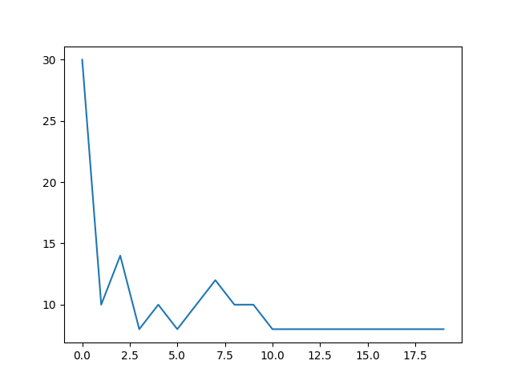
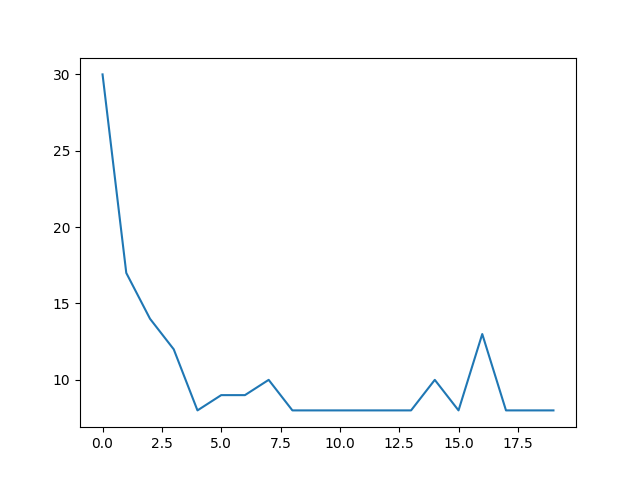

| Number of modules | Time for 20 episodes|
|------------------:|--------------------:|
|2                  |13.70s               |
|3                  |30.95s               |  
|4                  |48.63s               |
|5                  |66.40s               |  

#### Arbitrator's learning curves (4x4)

##### Number of modules = 2
<figure>

<figcaption> </figcaption>
</figure>

<figure>

<figcaption> 1 "random" module </figcaption>
</figure>

<figure>

<figcaption> Deterministic policies for modules </figcaption>
</figure>

##### Number of modules = 3
<figure>

<figcaption>  </figcaption>
</figure>

<figure>

<figcaption> 1 "random" module </figcaption>
</figure>

<figure>

<figcaption> 2 "random" modules </figcaption>
</figure>

##### Number of modules = 4
<figure>

<figcaption>  </figcaption>
</figure>

<figure>

<figcaption> 1 "random" module </figcaption>
</figure>

<figure>

<figcaption> 3 "random" modules </figcaption>
</figure>

##### Number of modules = 5
<figure>

<figcaption>  </figcaption>
</figure>

<figure>

<figcaption> 1 "random" module </figcaption>
</figure>

<figure>

<figcaption> 4 "random" modules </figcaption>
</figure>

<!--   --> 

#### Arbitrator's learning curves (5x5)
<figure>

<figcaption> 2 modules; t = 35.24s </figcaption>
</figure>

<figure>

<figcaption> 3 modules; t = 77.60s </figcaption>
</figure>

<figure>

<figcaption> 4 modules; t = 149.78s </figcaption>
</figure>

<figure>

<figcaption> 2 modules; 1 "random" (brittle) </figcaption>
</figure>

<figure>

<figcaption> 3 modules; 1 "random" (brittle) </figcaption>
</figure>

#### Arbitrator's learning curves (6x6)
<figure>

<figcaption> t = 87.20s </figcaption>
</figure>

<figure>

<figcaption> 2 modules; 1 "random" (brittle) </figcaption>
</figure>

#### Arbitrator's learning curves (7x7)
<figure>

<figcaption> t = 225.24s </figcaption>
</figure>

<figure>

<figcaption> 2 modules; 1 "random" (brittle) </figcaption>
</figure>

##### Notes:

* Learning become brittle with larger domains and "random" module.

* Works for any initialization of lambdas (>0)

* Reward curves become smoother as the number of modules increase.

* Increasing the number of modules have no effect on learning.
  
* With a "random" module as well, the arbitrator converges, but with a slight noise. (For #m = 2,3,4,5)

* Also works if there are >1 random modules. (At least one module needs to be non-random)

* Arbitrator's policy is non-composable: selects one module; doesn't compose a new policy from all the modules.

